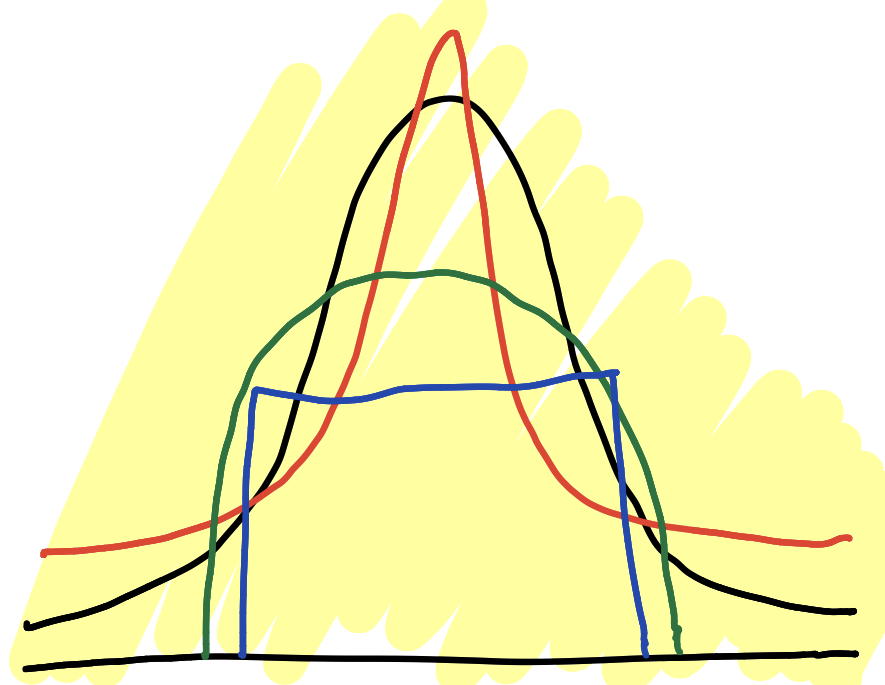

## Central Idea - What had work vs what makes sense

we live in a complex system with hard-to-see causal links, and an intricate web of interdependence. 

The human body is ‘opaque’; we need to rely on *what had worked for a long time, hence evolved through the lengthy and merciless evolutionary test of trial and error, rather than produce our own theories deemed causal*.

Furthermore, there are non-linearities in dose-response: a little might be beneficial, more may harm. Such non-linearitites make empiricism secondary to tradition – tradition is the result of a long series of trials that are recorded in the beliefs and practices of a society that survives. 

*- NASSIM NICHOLAS TALEB*

<b>kurtosis</b> is the statistical name for the degree these high-impact events play into a certain distribution of outcomes.

